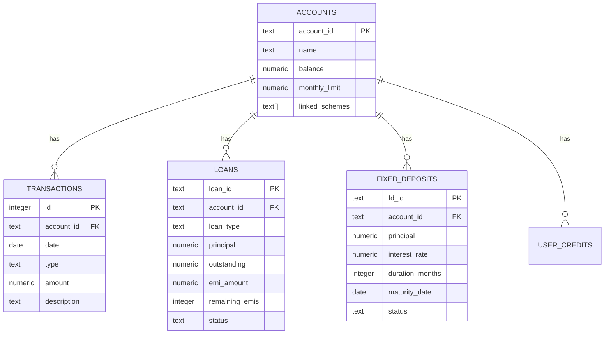

# Artha Mitra: Comprehensive Architecture Document

This document outlines the detailed system architecture, flow patterns, entity relationships, and optimizations of the **Artha Mitra** financial accessibility platform.

---

## 1. System Overview

Artha Mitra is built as a serverless, cloud-native application utilizing **Vercel** for hosting the frontend and serverless API handlers, **Supabase (PostgreSQL)** for transactional data persistence and rate-limiting security, and **Google AI Studio (Gemini 2.5 Flash)** for generative chat and Speech-to-Text (STT) capabilities.

```mermaid
graph TD
    User([User Voice/Text]) --> Frontend[React SPA / Vite]
    
    subgraph Client-Side Audio Optimization
        Frontend --> Mic[Audio Capture: 48kHz Stereo]
        Mic --> Resampler[OfflineAudioContext Resampler]
        Resampler --> Compressed[16kHz Mono WAV Blob]
    end
    
    Compressed --> STT_Endpoint[/api/stt]
    STT_Endpoint --> Gemini_STT[Gemini Multimodal transcription]
    Gemini_STT --> Transcript[Clean Text Transcript]
    
    Transcript --> Chat_Endpoint[/api/chat]
    User -- Text Input --- Chat_Endpoint
    
    subgraph Zero-Gemini Local Matcher
        Chat_Endpoint --> SpellCheck[Levenshtein spelling correction: natural]
        SpellCheck --> Entities[compromise Entity Extractor: amount, recipient]
        Entities --> OfflineRegistry{Matches 150+ offline patterns?}
    end
    
    OfflineRegistry -- Yes --> DB_RPC[Execute Direct Supabase RPC/Query]
    DB_RPC --> LocalResult[Immediate response, 0 credits used]
    
    OfflineRegistry -- No --> Classifier[Intent Classifier: Keyword + LLM Fallback]
    Classifier --> Dispatcher[Agent Dispatcher]
    
    subgraph Agent Swarm
        Dispatcher --> BankingAgent[Banking Agent]
        Dispatcher --> SchemesAgent[Schemes Agent]
        Dispatcher --> LiteracyAgent[Literacy Agent]
        Dispatcher --> FraudAgent[Fraud Agent]
        Dispatcher --> LoansAgent[Loans Specialist Agent]
        Dispatcher --> BudgetingAgent[Budgeting Specialist Agent]
      end
      
    BankingAgent & SchemesAgent & LiteracyAgent & FraudAgent & LoansAgent & BudgetingAgent --> GeminiPool[3-Key API key pool rotation]
    GeminiPool --> LLMResult[LLM-generated context-aware response]
    
    LocalResult & LLMResult --> Output[JSON Response to client]
```

---

## 2. Audio Optimization Pipeline

To support low-bandwidth rural connections (2G/3G/4G), Artha Mitra performs client-side downsampling using native browser web APIs before uploading audio to the Speech-to-Text API.

### Downsampling & Resampling Flow
1. **Audio Capture:** The browser captures user audio using the `MediaRecorder` API (defaulting to 48kHz Stereo, encoded in WebM or WAV format, resulting in ~1MB per 5 seconds of audio).
2. **Audio Decoding:** The raw Blob is decoded into an `AudioBuffer` using the browser's `AudioContext`.
3. **Resampling:** An `OfflineAudioContext` is instantiated at a target rate of **16,000 Hz Mono**.
4. **PCM Encoding:** The resampled buffer is converted into a 16-bit Mono PCM WAV representation.
5. **Payload Reduction:** The final payload size drops to **~120KB** (a **85%+ reduction** in payload size), resulting in immediate uploads and lower latency.

---

## 3. Intelligent Intent Classification & Routing

Artha Mitra runs a hybrid classification layer that optimizes latency, API usage, and accuracy.

```
Incoming Query
     │
     ▼
[Spelling Corrector (natural)]
     │
     ▼
[Local Registry Heuristics] ────(Match found)────► [Execute Supabase Transaction/Advisory] (0ms Latency)
     │
(No match)
     ▼
[Keyword Intent Classifier]
     │
 (Ambiguous)
     ▼
[Gemini LLM Intent Classifier]
     │
     ▼
[Agent Dispatcher] ───► [Specialist Agents (Loans, Budgeting, etc.)]
```

### Specialist Agent Matrix

| Agent | Scope | Key Methods / RPCs |
| :--- | :--- | :--- |
| **Banking Agent** | Balance queries, recent ledger, bill payments. | `pay_bill`, queries on `transactions` table. |
| **Schemes Agent** | Recommended government programs and enrollment details. | Scheme lookup, updates on `linked_schemes` array. |
| **Literacy Agent** | Answers educational queries on financial terms. | Multi-language literacy explanations. |
| **Fraud Guard Agent**| Inspects suspicious texts/requests for fraud patterns. | Fraud logs and risk profiling. |
| **Loans Advisor** | Calculates monthly EMIs and interest details offline. | Math formulas, `loans` tables. |
| **Budgeting Advisor**| Context-aware monthly limit analysis. | Queries `transactions` debits/credits. |

---

## 4. Supabase Database Schema

The persistent transactional state is managed in Supabase PostgreSQL using 13 highly indexed tables.



### Direct Database Functions (RPCs)
- **`pay_bill(account_id, bill_type, amount)`**: Checks balance, debits account, creates transaction, and returns a generated `receipt_id`.
- **`transfer_funds(from_id, to_id, amount)`**: Debits sender, credits receiver, inserts credit/debit transaction ledger items atomically inside a database transaction.
- **`create_fixed_deposit(account_id, amount, duration_months)`**: Subtracts principal from account balance and inserts a new FD record with standard maturity dates.

---

## 5. Resiliency & Scale Features

### 3-Key API Key Pool Rotation (`gemini-pool.js`)
To avoid rate limits on the Gemini free tier, the backend pools 3 different API keys.
- **Round-Robin Selection:** The system cycles keys sequentially.
- **Quota Error Interception:** If a key triggers a `RESOURCE_EXHAUSTED` (429) quota code, it is dynamically blacklisted for the current cycle. The system switches to the next key and retries the request without failing the user's chat message.
- **Usage Tracking:** All calls and failure counts are logged in `api_key_usage`.

### Credit Monitoring & Rate Limiter
- **Limit:** Enforced at 15 calls/minute and 200 calls/day per session via Supabase rate-limit trackers.
- **Credit Deductions:** Every LLM execution deducts 1 credit from `user_credits`, while local offline registry execution consumes **0 credits**.
- **Real-Time Dispatch:** Updates are pushed via custom context triggers directly to the React frontend `<CreditDisplay />` panel.
